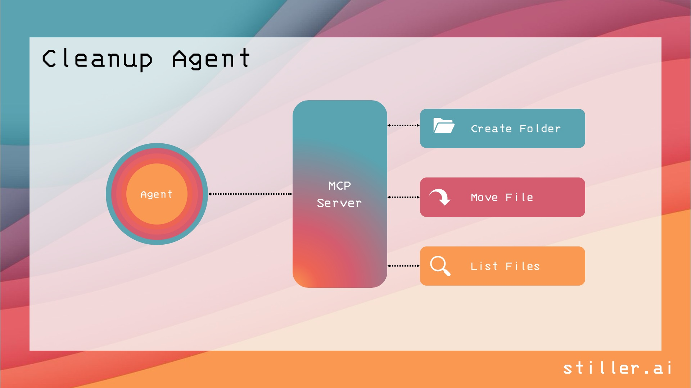

# 🧹 Cleanup Agent

The Cleanup Agent is a lightweight tool designed to manage and organize files through a central MCP Server. It supports folder creation, file movement, and listing operations — all triggered by a local or remote agent.

💡 Features
- 📁 Create Folder
- 🔄 Move File
- 🔍 List Files
  
🛠️ Architecture

The agent communicates with the MCP Server, which performs file operations.
See the architecture diagram below:




# Setup 

```bash
python -m venv agent
source agent/bin/activate
pip install -r requirements.txt
```

# Running Instructions

```bash
python mcp_server # start mcp server
python agent.py
```
The agent will open the following dialog:
```
which directory I should clean?
Please enter the full path: <enter the path here>
```
